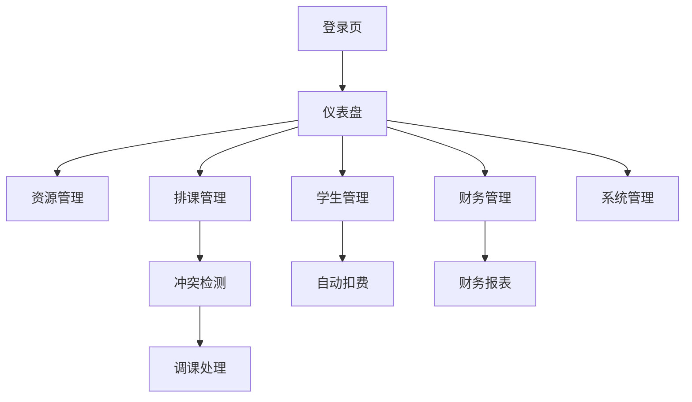

## 1. 产品概述
学校管理系统是一个综合性的教育管理平台，旨在解决学校日常运营中的资源调度、学生管理、财务处理等核心问题。系统通过PC管理端和微信小程序双端协同，为管理员、教师和学生提供便捷的服务，提升学校管理效率。

目标用户包括学校管理人员、教师和学生，通过数字化管理减少人工操作，提高教务管理效率。

## 2. 核心功能

### 2.1 用户角色

| 角色 | 注册方式 | 核心权限 |
|------|----------|----------|
| 系统管理员 | 后台创建 | 系统管理、用户管理、权限分配 |
| 教务管理员 | 后台创建 | 资源管理、排课管理、财务管理 |
| 教师 | 后台创建/微信小程序注册 | 查看课表、学生签到、教学统计 |
| 学生 | 微信小程序注册 | 课程预约、查看课表、学习统计 |

### 2.2 功能模块

系统主要包含以下核心页面：
1. **仪表盘**：数据概览、关键指标展示、快捷操作入口
2. **资源管理**：教室管理、设备管理、资源配置
3. **排课管理**：课程安排、冲突检测、调课处理
4. **学生管理**：学生信息、学习记录、钱包管理
5. **财务管理**：收支统计、自动扣费、财务报表
6. **系统管理**：用户管理、角色权限、系统配置

### 2.3 页面详情

| 页面名称 | 模块名称 | 功能描述 |
|----------|----------|----------|
| 仪表盘 | 数据概览 | 显示学生总数、课程总数、收入统计等关键指标 |
| 仪表盘 | 快捷操作 | 提供常用功能的快速入口，如新增课程、查看预约等 |
| 资源管理 | 教室管理 | 添加、编辑、删除教室信息，设置容量和设备 |
| 资源管理 | 设备管理 | 管理教学设备，关联教室和设备 |
| 排课管理 | 课程安排 | 创建课程安排，设置时间、地点、教师 |
| 排课管理 | 冲突检测 | 自动检测时间、地点、教师冲突并提示 |
| 排课管理 | 调课处理 | 处理调课申请，重新安排课程时间和地点 |
| 学生管理 | 学生信息 | 查看和编辑学生基本信息、联系方式 |
| 学生管理 | 学习记录 | 查看学生的课程参与记录和学习进度 |
| 学生管理 | 钱包管理 | 管理学生账户余额，查看充值和消费记录 |
| 财务管理 | 收支统计 | 统计收入支出，生成财务报表 |
| 财务管理 | 自动扣费 | 设置扣费规则，自动处理课程费用扣除 |
| 系统管理 | 用户管理 | 管理系统用户，分配角色和权限 |
| 系统管理 | 角色权限 | 配置不同角色的功能权限和数据权限 |

## 3. 核心流程

### 管理员流程
管理员登录系统后，可以进行资源管理、排课安排、学生管理和财务处理。排课时系统会自动检测冲突，课程结束后系统自动扣除学生费用。

### 教师流程
教师通过微信小程序查看个人课表，进行学生签到，查看教学统计数据。

### 学生流程
学生通过微信小程序预约课程，查看个人课表和学习统计，系统自动管理课程费用。

## 4. 用户界面设计

### 4.1 设计风格
- **主色调**：蓝色系（#1890ff）为主，体现教育行业的专业性
- **辅助色**：绿色（#52c41a）表示成功，红色（#f5222d）表示警告
- **按钮样式**：圆角矩形，主要操作为实心按钮，次要操作为线框按钮
- **字体**：系统默认字体，标题16px，正文14px，辅助文字12px
- **布局风格**：左侧导航菜单 + 右侧内容区域的经典后台布局
- **图标风格**：使用Element Plus图标库，线性图标为主

### 4.2 页面设计概述

| 页面名称 | 模块名称 | UI元素 |
|----------|----------|----------|
| 仪表盘 | 数据卡片 | 使用卡片布局展示统计数据，包含图标和数字 |
| 资源管理 | 表格展示 | 使用表格展示资源列表，支持搜索和筛选 |
| 排课管理 | 时间表格 | 使用周视图展示课程安排，冲突用红色标记 |
| 学生管理 | 列表+详情 | 左侧学生列表，右侧详细信息面板 |
| 财务管理 | 图表展示 | 使用柱状图和折线图展示收支趋势 |

### 4.3 响应式设计
系统采用桌面端优先设计，PC管理端主要面向大屏幕使用，确保在1024px以上分辨率的最佳体验。管理界面不考虑移动端适配。