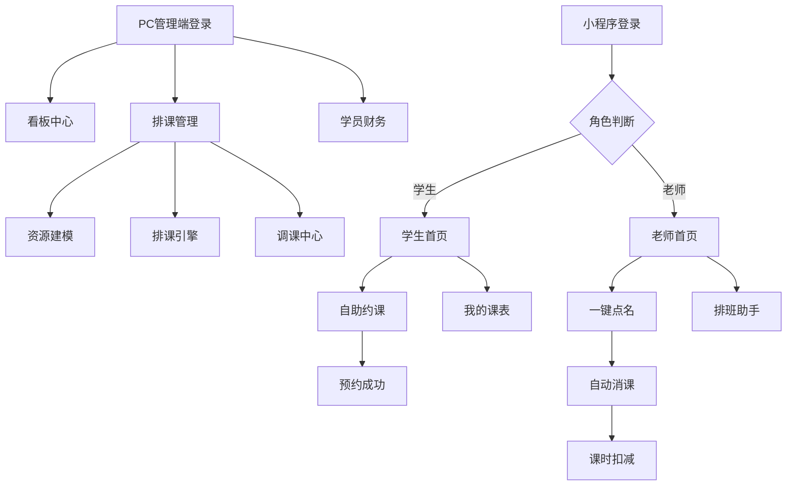

## 1. 产品概述
学校管理系统是一个综合性的教育管理平台，采用多端合一的架构设计。系统通过PC管理端实现教务管理和财务运营，通过小程序端为老师和学生提供便捷的约课、点名和消课功能，所有端共享同一个高性能Go后端API。

该系统解决了传统教育培训机构在排课、点名、课时管理等方面的效率问题，为校长、教务、老师、学生及家长提供了一站式的教育管理解决方案。

## 2. 核心功能

### 2.1 用户角色
| 角色 | 注册方式 | 核心权限 |
|------|----------|----------|
| 校长 | 后台创建 | 全权限管理，包括系统配置、财务数据、所有校区管理 |
| 教务 | 后台创建 | 排课管理、学员档案、调课操作、老师管理 |
| 财务 | 后台创建 | 课包售卖、退费处理、营收统计、合同管理 |
| 老师 | 小程序注册 | 查看课表、点名消课、学员评价、空闲时间设置 |
| 学生/家长 | 小程序注册 | 自助约课、查看课表、请假申请、学习动态 |

### 2.2 功能模块
系统包含以下核心页面：

**PC管理端：**
1. **看板中心**：今日课表流、剩余课时预警、营收走势图
2. **排课管理**：资源建模、排课引擎、调课中心
3. **学员财务**：档案管理、课包售卖、退费处理
4. **权限管理**：角色配置、权限分配

**小程序端：**
1. **学生首页**：自助约课、我的课表、消课通知、学习动态
2. **老师首页**：教学工作台、一键点名、排班助手、学员管理
3. **个人中心**：个人信息、设置、帮助

### 2.3 页面详情
| 页面名称 | 模块名称 | 功能描述 |
|----------|----------|----------|
| 看板中心 | 今日课表流 | 实时显示全校区今日所有课程安排，支持按校区、老师筛选 |
| 看板中心 | 剩余课时预警 | 自动统计学员剩余课时，低于设定阈值时高亮提醒 |
| 看板中心 | 营收走势图 | 展示月度营收趋势，支持按校区、课程类型筛选 |
| 排课管理 | 资源建模 | 配置校区信息、教室容量、课程单价和时长 |
| 排课管理 | 排课引擎 | 支持固定重复排课和单次排课，自动检测时间冲突 |
| 排课管理 | 调课中心 | 批量修改课表，一键通知相关老师和学生 |
| 学员财务 | 档案管理 | 查看学员剩余课时、消费记录、上课历史 |
| 学员财务 | 课包售卖 | 处理学生充值、生成合同、上传附件 |
| 小程序学生首页 | 自助约课 | 按老师或课程筛选可预约时段，支持一键预约 |
| 小程序学生首页 | 我的课表 | 日历形式展示个人课表，支持请假申请 |
| 小程序老师首页 | 一键点名 | 勾选到场学生，自动触发课时扣减和薪酬计算 |
| 小程序老师首页 | 排班助手 | 设置下周空闲时间，自动生成可约时段 |

## 3. 核心流程

### 3.1 学生约课流程
学生打开小程序 → 选择自助约课 → 筛选老师/课程 → 选择空闲时段 → 确认预约 → 系统生成预约记录 → 发送预约成功通知

### 3.2 老师点名消课流程
老师进入教学工作台 → 查看今日待上课列表 → 点击一键点名 → 勾选到场学生 → 提交点名 → 系统自动：更新预约状态为已上课 → 扣减学生课时 → 生成消课记录 → 发送课时扣减通知给学生

### 3.3 教务排课流程
教务登录PC端 → 进入排课管理 → 选择排课类型（固定/单次）→ 设置课程信息 → 系统检测冲突 → 确认排课 → 自动生成课程安排 → 通知相关老师和学生

## 4. 用户界面设计

### 4.1 设计风格
- **主色调**：教育蓝 (#1890ff) + 活力橙 (#fa8c16)
- **辅助色**：深灰 (#595959)、浅灰 (#f5f5f5)、成功绿 (#52c41a)
- **按钮样式**：圆角矩形，主按钮使用主色调，次要按钮使用边框样式
- **字体**：中文使用PingFang SC，英文使用Roboto，正文字号14px，标题字号16-20px
- **布局风格**：卡片式布局，信息层级清晰，重要信息突出显示
- **图标风格**：使用Ant Design图标库，线性风格，统一尺寸

### 4.2 页面设计概览
| 页面名称 | 模块名称 | UI元素 |
|----------|----------|--------|
| 看板中心 | 数据看板 | 顶部统计卡片展示关键指标，使用大字号数字和趋势图标 |
| 看板中心 | 课表流 | 时间轴形式展示，当前时间高亮，支持横向滚动 |
| 排课管理 | 排课表单 | 分步骤表单设计，每步包含必填验证，支持暂存草稿 |
| 小程序学生首页 | 约课卡片 | 横向滑动的课程卡片，显示老师头像、课程名称、剩余名额 |
| 小程序老师首页 | 点名界面 | 学生头像网格布局，支持批量选择和全选功能 |

### 4.3 响应式设计
- PC管理端采用桌面优先设计，最小支持1366px宽度
- 小程序端适配各种手机屏幕，重点优化iPhone和主流Android机型
- 触摸交互优化：按钮点击区域不小于44px，支持长按操作
- 数据表格支持横向滚动，确保在小屏幕上也能完整显示

## 5. 性能要求
- 页面加载时间不超过3秒
- 点名操作响应时间不超过1秒
- 支持1000+并发用户同时在线
- 数据查询响应时间不超过500ms