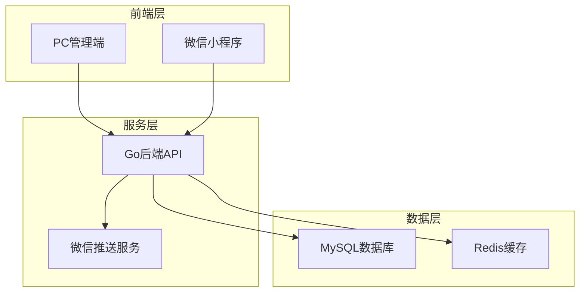
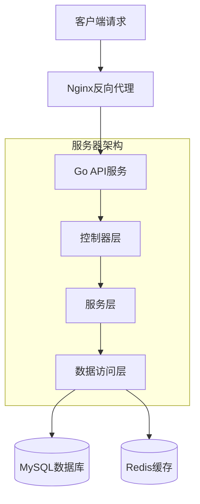
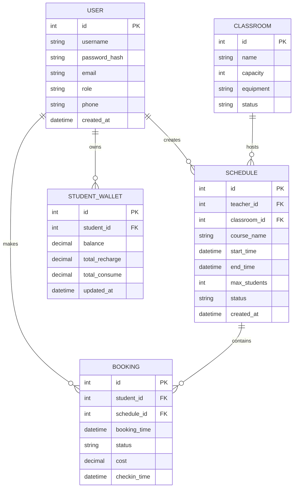

## 1. 架构设计



## 2. 技术描述

* **PC管理端**: Vue 3 + Element Plus + Vite

* **初始化工具**: vite-init

* **后端服务**: Go + Gin框架

* **数据库**: MySQL 8.0

* **缓存**: Redis 6.0

* **消息推送**: 微信服务号消息推送

* **容器化**: Docker + Docker Compose

* **反向代理**: Nginx

## 3. 路由定义

### PC管理端路由

| 路由          | 用途             |
| ----------- | -------------- |
| /login      | 登录页面，管理员身份验证   |
| /dashboard  | 仪表盘，展示系统核心数据   |
| /resources  | 资源管理，教室和设备管理   |
| /scheduling | 排课管理，课程安排和冲突检测 |
| /students   | 学生管理，学生信息和钱包管理 |
| /finance    | 财务管理，收支统计和报表   |
| /system     | 系统管理，用户和权限管理   |

### 后端API路由

| 路由                 | 用途       |
| ------------------ | -------- |
| /api/auth/login    | 用户登录验证   |
| /api/resources/\*  | 资源管理相关接口 |
| /api/scheduling/\* | 排课管理相关接口 |
| /api/students/\*   | 学生管理相关接口 |
| /api/finance/\*    | 财务管理相关接口 |
| /api/wechat/\*     | 微信小程序接口  |

## 4. API定义

### 4.1 核心API

用户登录

```
POST /api/auth/login
```

请求参数：

| 参数名      | 参数类型   | 是否必填 | 描述        |
| -------- | ------ | ---- | --------- |
| username | string | 是    | 用户名       |
| password | string | 是    | 密码（MD5加密） |

响应参数：

| 参数名      | 参数类型   | 描述    |
| -------- | ------ | ----- |
| token    | string | JWT令牌 |
| userInfo | object | 用户信息  |

排课冲突检测

```
POST /api/scheduling/check-conflict
```

请求参数：

| 参数名         | 参数类型     | 是否必填 | 描述   |
| ----------- | -------- | ---- | ---- |
| courseId    | int      | 是    | 课程ID |
| teacherId   | int      | 是    | 教师ID |
| classroomId | int      | 是    | 教室ID |
| startTime   | datetime | 是    | 开始时间 |
| endTime     | datetime | 是    | 结束时间 |

自动扣费

```
POST /api/finance/auto-deduct
```

请求参数：

| 参数名       | 参数类型    | 是否必填 | 描述     |
| --------- | ------- | ---- | ------ |
| studentId | int     | 是    | 学生ID   |
| amount    | decimal | 是    | 扣除金额   |
| courseId  | int     | 是    | 关联课程ID |

## 5. 服务器架构图



## 6. 数据模型

### 6.1 数据模型定义



### 6.2 数据定义语言

用户表（users）

```sql
-- 创建用户表
CREATE TABLE users (
  id INT PRIMARY KEY AUTO_INCREMENT,
  username VARCHAR(50) UNIQUE NOT NULL,
  password_hash VARCHAR(255) NOT NULL,
  email VARCHAR(100) UNIQUE,
  phone VARCHAR(20),
  role ENUM('admin', 'teacher', 'student') DEFAULT 'student',
  status ENUM('active', 'inactive') DEFAULT 'active',
  created_at TIMESTAMP DEFAULT CURRENT_TIMESTAMP,
  updated_at TIMESTAMP DEFAULT CURRENT_TIMESTAMP ON UPDATE CURRENT_TIMESTAMP
);

-- 创建索引
CREATE INDEX idx_users_username ON users(username);
CREATE INDEX idx_users_role ON users(role);
```

课程安排表（schedules）

```sql
-- 创建课程安排表
CREATE TABLE schedules (
  id INT PRIMARY KEY AUTO_INCREMENT,
  teacher_id INT NOT NULL,
  classroom_id INT NOT NULL,
  course_name VARCHAR(100) NOT NULL,
  start_time DATETIME NOT NULL,
  end_time DATETIME NOT NULL,
  max_students INT DEFAULT 20,
  status ENUM('scheduled', 'ongoing', 'completed', 'cancelled') DEFAULT 'scheduled',
  created_at TIMESTAMP DEFAULT CURRENT_TIMESTAMP,
  FOREIGN KEY (teacher_id) REFERENCES users(id),
  FOREIGN KEY (classroom_id) REFERENCES classrooms(id)
);

-- 创建索引
CREATE INDEX idx_schedules_teacher ON schedules(teacher_id);
CREATE INDEX idx_schedules_classroom ON schedules(classroom_id);
CREATE INDEX idx_schedules_time ON schedules(start_time, end_time);
```

预约表（bookings）

```sql
-- 创建预约表
CREATE TABLE bookings (
  id INT PRIMARY KEY AUTO_INCREMENT,
  student_id INT NOT NULL,
  schedule_id INT NOT NULL,
  booking_time TIMESTAMP DEFAULT CURRENT_TIMESTAMP,
  status ENUM('booked', 'attended', 'absent', 'cancelled') DEFAULT 'booked',
  cost DECIMAL(10,2) DEFAULT 0.00,
  checkin_time TIMESTAMP NULL,
  FOREIGN KEY (student_id) REFERENCES users(id),
  FOREIGN KEY (schedule_id) REFERENCES schedules(id),
  UNIQUE KEY unique_booking (student_id, schedule_id)
);

-- 创建索引
CREATE INDEX idx_bookings_student ON bookings(student_id);
CREATE INDEX idx_bookings_schedule ON bookings(schedule_id);
```

学生钱包表（student\_wallets）

```sql
-- 创建学生钱包表
CREATE TABLE student_wallets (
  id INT PRIMARY KEY AUTO_INCREMENT,
  student_id INT UNIQUE NOT NULL,
  balance DECIMAL(10,2) DEFAULT 0.00,
  total_recharge DECIMAL(10,2) DEFAULT 0.00,
  total_consume DECIMAL(10,2) DEFAULT 0.00,
  updated_at TIMESTAMP DEFAULT CURRENT_TIMESTAMP ON UPDATE CURRENT_TIMESTAMP,
  FOREIGN KEY (student_id) REFERENCES users(id)
);

-- 创建索引
CREATE INDEX idx_wallets_student ON student_wallets(student_id);
```

教室表（classrooms）

```sql
-- 创建教室表
CREATE TABLE classrooms (
  id INT PRIMARY KEY AUTO_INCREMENT,
  name VARCHAR(50) NOT NULL,
  capacity INT DEFAULT 30,
  equipment TEXT,
  status ENUM('available', 'maintenance', 'closed') DEFAULT 'available',
  created_at TIMESTAMP DEFAULT CURRENT_TIMESTAMP
);

-- 初始化数据
INSERT INTO classrooms (name, capacity, equipment) VALUES
('教室A', 30, '投影仪,音响,白板'),
('教室B', 25, '投影仪,音响'),
('教室C', 20, '投影仪,电脑');
```

